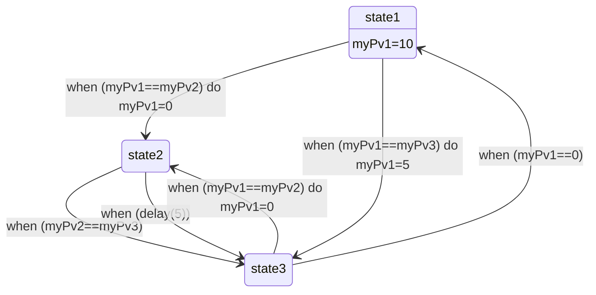
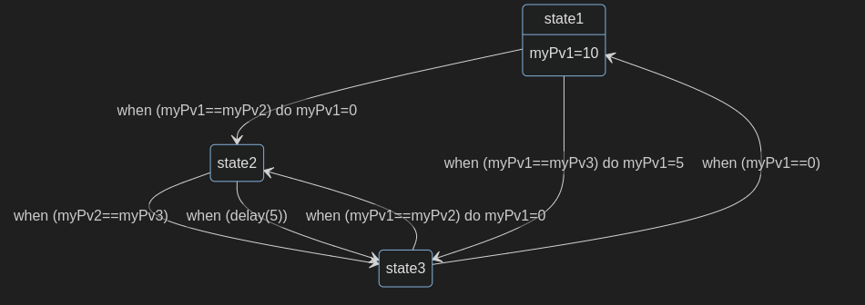

# Introduction

Easily create a state machine diagram from your SNL program. Based on the Mermaid diagramming tool.

# Usage

The script generates Mermaid-based Markdown file. This file needs to be rendered with tools that manage Mermaid diagrams.
Pandoc / quarto : to do

Usage: ./script.py path/to/your_file.st path/to/output_diagram.md

Example :

```
ss ss2
{

    state state1

    {
		entry
		{
			myPv1=10;
		}

		when (myPv1==myPv2)
		{
			myPv1=0;
		} state state2

		when (myPv1==myPv3)
		{
			myPv1=5;
		} state state3
	}

	state state2

	{
		when (myPv2==myPv3)
		{} state state3

		when (delay(5))
		{} state state3
	}

    state state3

    {
		when (myPv1==0)
		{} state state1

		when (myPv1==myPv2)
		{
			myPv1=0;
		} state state2
	}
}
```



