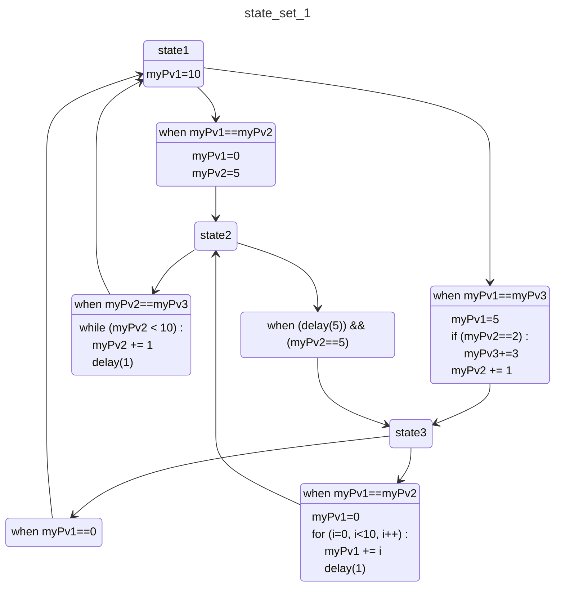

# Introduction

Welcome to PLASMA ! PLAin State Machine Acquaintance allows one to easily create a state machine diagram from a SNL program. It is based on the Mermaid diagramming tool.

The script generates Mermaid-based Markdown file. This file needs to be rendered with tools that manage Mermaid diagrams (Gitlab does, that's a good start !)

Pandoc / quarto : to do

PLASMA is based on the [tree-sitter-epics parser](https://github.com/epics-extensions/tree-sitter-epics).


## Build using Poetry

First, install Poetry.
Refer to the [Poetry installation documentation](https://python-poetry.org/docs/#installation) for instructions.

To build the project,
you can run:

``` bash
poetry install
poetry build
```

## Execution

``` bash
poetry run ./plasma.py test/small_example.st mmd output.mmd -v 2 # light diagram
poetry run ./plasma.py test/small_example.st mmd output.mmd -ps -v 2 # full diagram including all statements
```

# Usage
```
usage: plasma.py [-h] [-ps] [-v {0,1,2,3,4,5}] input_file {mmd,md} output_file

Script to create a stae diagram from a SNL state machine

positional arguments:
  input_file            Input file, SNL format
  {mmd,md}              Output format, mermaid format or markdown format with Mermaid syntax.
  output_file           Output file name

options:
  -h, --help            show this help message and exit
  -ps, --print-statements
                        Print all statements included in entry or transition blocks
  -v {0,1,2,3,4,5}, --verbosity {0,1,2,3,4,5}
                        decrease output verbosity. 5 (Critical), 4 (Error), 3 (Warning, default), 2 (Info), 1 (Debug)
```

# Recommendations

To make the resulting diagram more readable, one should try to respect a few rules :   
- avoid long lines : for example one can try to replace a long transition condition by two transitions to two intermediate states (note that Plasme could also manage long lines splitting but it's not the case as of today)   
- more to add ?

# Example

```
ss state_set_1
{

    state state1

    {
		entry
		{
			myPv1=10;
			pvPut(myPv1);
		}

		when (myPv1==myPv2)
		{
			myPv1=0;
			myPv2=5;
		} state state2

		when (myPv1==myPv3)
		{
			myPv1=5;
			if (myPv2==2) {
				myPv3+=3;
			}
			myPv2 += 1;
		} state state3
	}

	state state2

	{
		when (myPv2==myPv3)
		{
			while (myPv2 < 10) {
				myPv2 += 1;
				delay(1);
			}
		} state state1

		when ((delay(5)) && (myPv2==5))
		{} state state3
	}

    state state3

    {
		when (myPv1==0)
		{} state state1

		when (myPv1==myPv2)
		{
			myPv1=0;
			for (i=0; i<10; i++) {
				myPv1 += i;
				delay(1);
			}
			
		} state state2
	}
}
```


