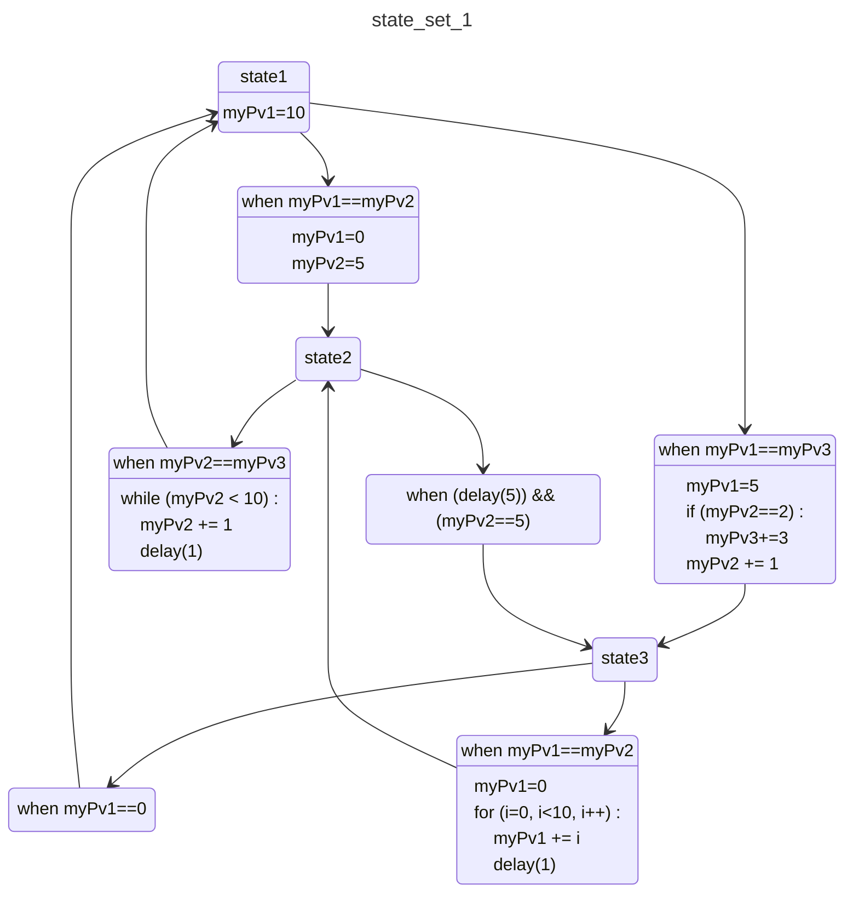

> [!CAUTION]
> This repo is archived and should't be used anymore.
> PLASMA is now hosted at https://github.com/epics-extensions/plasma

# Introduction

Welcome to PLASMA ! PLAin State Machine Acquaintance allows one to easily create a state machine diagram from a SNL program.

The script generates Mermaid files. Each state set (ss) of the SNL program creates its own Mermaid file in an output folder. These files need to be rendered with tools that manage Mermaid diagrams (Gitlab does, that's a good start !)

PLASMA is based on:

- [tree-sitter-snl](https://github.com/minijackson/tree-sitter-snl) for parsing the SNL file.

- [Mermaid](https://mermaid.ai/web/) for diagramming.

Pandoc / quarto : to do

## Build using Poetry

First, install Poetry.
Refer to the [Poetry installation documentation](https://python-poetry.org/docs/#installation) for instructions.

To build the project,
you can run:

``` bash
poetry install
poetry build
```

## Execution

``` bash
poetry run ./plasma.py examples/small_example.st output.mmd -v 2 # light diagram
poetry run ./plasma.py examples/small_example.st output.mmd -ps -v 2 # full diagram including all statements
```

# Usage
```
usage: plasma.py [-h] [-ps] [--state-style STATE_STYLE] [--transition-style TRANSITION_STYLE] [-v {0,1,2,3,4,5}] input_file output_folder

Script to create state diagrams from a SNL program. Each state set (ss) creates a Mermaid file in the output folder.

positional arguments:
  input_file            Input file, SNL format
  output_folder         Output folder

options:
  -h, --help            show this help message and exit
  -ps, --print-statements
                        Print all statements included in entry or transition blocks
  --state-style STATE_STYLE
                        Define styling for state represententation (e.g. fill:#FFFAAA,stroke:black,color:black). See https://mermaid.js.org/syntax/stateDiagram.html#styling-with-
                        classdefs.
  --transition-style TRANSITION_STYLE
                        Define styling for transition represententation (e.g. fill:#CFFFA0,stroke:black,color:black). See https://mermaid.js.org/syntax/stateDiagram.html#styling-with-
                        classdefs.
  -v {0,1,2,3,4,5}, --verbosity {0,1,2,3,4,5}
                        decrease output verbosity. 5 (Critical), 4 (Error), 3 (Warning, default), 2 (Info), 1 (Debug)
```

# Notes

- Inclusion of other SNL files is not supported (via `#include myStateSet.st`). One must manage includes manually before using PLASMA.

- Not all Mermaid visualizers support the `classDef` definition, set by `--state-style` and `--transition-style` arguments.

# Example

```
ss state_set_1
{

    state state1

    {
		entry
		{
			myPv1=10;
			pvPut(myPv1);
		}

		when (myPv1==myPv2)
		{
			myPv1=0;
			myPv2=5;
		} state state2

		when (myPv1==myPv3)
		{
			myPv1=5;
			if (myPv2==2) {
				myPv3+=3;
			}
			myPv2 += 1;
		} state state3
	}

	state state2

	{
		when (myPv2==myPv3)
		{
			while (myPv2 < 10) {
				myPv2 += 1;
				delay(1);
			}
		} state state1

		when ((delay(5)) && (myPv2==5))
		{} state state3
	}

    state state3

    {
		when (myPv1==0)
		{} state state1

		when (myPv1==myPv2)
		{
			myPv1=0;
			for (i=0; i<10; i++) {
				myPv1 += i;
				delay(1);
			}
			
		} state state2
	}
}
```


```mermaid
---
title: state_set_1
---
stateDiagram
    classDef state_style fill:#FFFAAA,stroke:black,color:black
    classDef transition_style fill:#CFFFA0,stroke:black,color:black
    state1:::state_style
    state1 : state1
    state1:  myPv1=10
    state1_transition_1:::transition_style
    state1 -->state1_transition_1
    state1_transition_1 : when myPv1==myPv2
    state1_transition_1:  myPv1=0
    state1_transition_1:  myPv2=5
    state1_transition_1 -->state2
    state1_transition_2:::transition_style
    state1 -->state1_transition_2
    state1_transition_2 : when myPv1==myPv3
    state1_transition_2:  myPv1=5
    state1_transition_2 :  if (myPv2==2) #colon; 
    state1_transition_2: #nbsp; #nbsp;  myPv3+=3
    state1_transition_2:  myPv2 += 1
    state1_transition_2 -->state3
    state2:::state_style
    state2 : state2
    state2_transition_1:::transition_style
    state2 -->state2_transition_1
    state2_transition_1 : when myPv2==myPv3
    state2_transition_1 :  while (myPv2 < 10) #colon; 
    state2_transition_1: #nbsp; #nbsp;  myPv2 += 1
    state2_transition_1: #nbsp; #nbsp;  delay(1)
    state2_transition_1 -->state1
    state2_transition_2:::transition_style
    state2 -->state2_transition_2
    state2_transition_2 : when (delay(5)) && (myPv2==5)
    state2_transition_2 -->state3
    state3:::state_style
    state3 : state3
    state3_transition_1:::transition_style
    state3 -->state3_transition_1
    state3_transition_1 : when myPv1==0
    state3_transition_1 -->state1
    state3_transition_2:::transition_style
    state3 -->state3_transition_2
    state3_transition_2 : when myPv1==myPv2
    state3_transition_2:  myPv1=0
    state3_transition_2 :  for (i=0, i<10, i++) #colon; 
    state3_transition_2: #nbsp; #nbsp;  myPv1 += i
    state3_transition_2: #nbsp; #nbsp;  delay(1)
    state3_transition_2 -->state2
```
